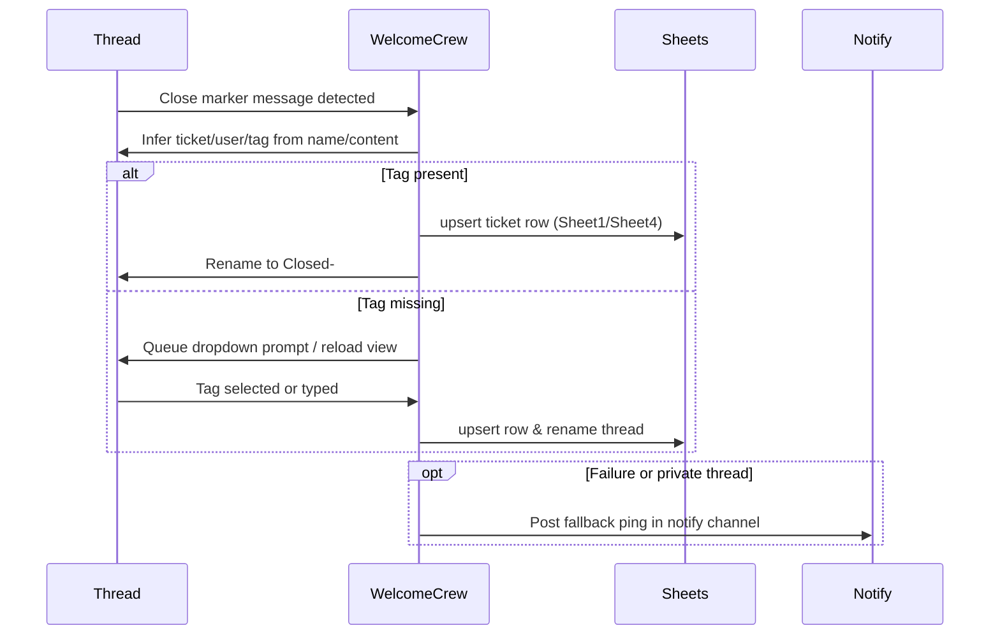

# C1C WelcomeCrew Functionality — 2025-10-14

## Overview
C1C WelcomeCrew automates welcome and promotion thread management: it watches Discord threads for closure markers, infers clan tags, prompts staff when data is missing, and upserts ticket records into Google Sheets while offering maintenance commands and health endpoints.【F:AUDIT/20251010_src/WC/bot_welcomecrew.py†L55-L88】【F:AUDIT/20251010_src/WC/bot_welcomecrew.py†L1398-L1809】It focuses on logging welcome/promotion outcomes and keeping sheets tidy; application intake, manual moderation, or DM onboarding flows remain out-of-scope.

## Entry points and startup flow
* `_boot()` validates the Discord token, launches the aiohttp web server, and starts the bot client.【F:AUDIT/20251010_src/WC/bot_welcomecrew.py†L1805-L1812】
* `start_webserver()` exposes `/`, `/ready`, `/health`, and `/healthz` endpoints with optional strict probing, sharing an aiohttp session for future integrations.【F:AUDIT/20251010_src/WC/bot_welcomecrew.py†L1473-L1596】
* `setup_hook()` syncs slash commands and preloads clan tags so dropdowns have data immediately.【F:AUDIT/20251010_src/WC/bot_welcomecrew.py†L281-L299】
* `on_ready()` starts the watchdog loop and schedules the timed refresh task that reloads clan tags and warms worksheet handles.【F:AUDIT/20251010_src/WC/bot_welcomecrew.py†L1414-L1600】

## Function map
| Symbol | Responsibility |
| --- | --- |
| `env_bool` and environment constants | Centralize environment-driven toggles, IDs, and sheet configuration (welcome, promo, notify).【F:AUDIT/20251010_src/WC/bot_welcomecrew.py†L32-L88】 |
| `get_ws`, `gs_client`, `_run_blocking`, `_with_backoff` | Manage Google Sheets connections with cached worksheet handles, thread offloading, and exponential backoff on transient errors.【F:AUDIT/20251010_src/WC/bot_welcomecrew.py†L115-L181】 |
| Clan tag utilities (`_load_clan_tags`, `_match_tag_in_text`, `_pick_tag_by_suffix`) | Fetch and normalize clan tags from the clanlist sheet, supplying regex-based inference for thread names and messages.【F:AUDIT/20251010_src/WC/bot_welcomecrew.py†L300-L431】 |
| Upsert helpers (`upsert_welcome`, `upsert_promo`, `dedupe_sheet`) | Locate or append sheet rows with throttling, diff tracking, and duplicate pruning logic.【F:AUDIT/20251010_src/WC/bot_welcomecrew.py†L400-L564】 |
| Thread parsing & tagging (`parse_welcome_thread_name_allow_missing`, `parse_promo_thread_name`, `infer_clantag_from_thread`) | Extract ticket numbers, usernames, and clan tags from thread names or message content, optionally joining threads to inspect history.【F:AUDIT/20251010_src/WC/bot_welcomecrew.py†L572-L655】 |
| Finalizers (`_finalize_welcome`, `_finalize_promo`, `_rename_welcome_thread_if_needed`) | Rename threads to canonical `Closed-####-username-TAG`, log actions, and write rows into Sheet1/Sheet4 with timestamps.【F:AUDIT/20251010_src/WC/bot_welcomecrew.py†L732-L815】 |
| Backfill scanners (`scan_welcome_channel`, `scan_promo_channel`, `_handle_*`) | Traverse active and archived threads to reconcile sheet data, collecting metrics and reasons for skipped records.【F:AUDIT/20251010_src/WC/bot_welcomecrew.py†L816-L940】 |
| Command suite (`env_check`, `sheetstatus`, `backfill_tickets`, etc.) | Operational commands gated by feature toggles for environment validation, sheet stats, dedupe, cache clearing, health, and restarts.【F:AUDIT/20251010_src/WC/bot_welcomecrew.py†L1007-L1277】 |
| Live watchers (`on_message`, `on_thread_update`, tag picker views) | Detect close markers, maintain pending tag prompts, and log completion events or fallback notifications.【F:AUDIT/20251010_src/WC/bot_welcomecrew.py†L1362-L1803】 |
| Scheduling (`scheduled_refresh_loop`, `_watchdog`) | Refresh clan tags three times daily and restart on prolonged disconnect or zombie conditions.【F:AUDIT/20251010_src/WC/bot_welcomecrew.py†L1517-L1600】【F:AUDIT/20251010_src/WC/bot_welcomecrew.py†L1398-L1471】 |

## Event handlers and background tasks
* `on_message` drives the live watcher: it detects close markers, stores pending prompts when tags are missing, auto-joins threads when mentioned, and finalizes tickets when tags appear in follow-up messages.【F:AUDIT/20251010_src/WC/bot_welcomecrew.py†L1626-L1721】
* `on_thread_update` reacts to archive/lock transitions, triggering prompts or finalizing data when threads close or reopen.【F:AUDIT/20251010_src/WC/bot_welcomecrew.py†L1726-L1803】
* `scheduled_refresh_loop` repeatedly loads clan tags and sheet handles at configured local times, optionally announcing refreshes in `LOG_CHANNEL_ID`.【F:AUDIT/20251010_src/WC/bot_welcomecrew.py†L1517-L1600】
* `_watchdog` monitors gateway idleness or extended disconnects to restart the process proactively.【F:AUDIT/20251010_src/WC/bot_welcomecrew.py†L1398-L1471】

## Commands and permissions
* Help:
  * `!help [topic]` sends the mobile-friendly embed or topic-specific descriptions; `/help` slash command mirrors the embed.【F:AUDIT/20251010_src/WC/bot_welcomecrew.py†L191-L276】
* Environment & health:
  * `!env_check` verifies required environment variables, toggles, and offers hints for misconfiguration.【F:AUDIT/20251010_src/WC/bot_welcomecrew.py†L1007-L1096】
  * `!sheetstatus`, `!checksheet`, and `!health` inspect sheet connectivity, row counts, and bot latency.【F:AUDIT/20251010_src/WC/bot_welcomecrew.py†L1107-L1252】
  * `!ping` reacts with 🏓 for a lightweight liveness check.【F:AUDIT/20251010_src/WC/bot_welcomecrew.py†L1098-L1105】
* Backfill & maintenance:
  * `!backfill_tickets` scans welcome/promo channels (respecting feature toggles), updating sheets while streaming progress; `!backfill_stop` cancels mid-run and `!backfill_details` exports diffs.【F:AUDIT/20251010_src/WC/bot_welcomecrew.py†L1120-L1204】
  * `!dedupe_sheet` prunes duplicate tickets in both sheets, while `!reload` clears caches for sheets and tag data.【F:AUDIT/20251010_src/WC/bot_welcomecrew.py†L1205-L1241】
  * `!reboot` exits the process after a short delay to trigger a platform restart.【F:AUDIT/20251010_src/WC/bot_welcomecrew.py†L1272-L1276】
* Watcher diagnostics:
  * `!watch_status` reports watcher on/off state and the last five logged actions.【F:AUDIT/20251010_src/WC/bot_welcomecrew.py†L1278-L1297】

## Workflow — member joins → onboarding/logging
1. **Thread creation & monitoring**: The bot auto-joins relevant threads and watches for close markers in messages, building normalized ticket/user/tag data from thread titles or content.【F:AUDIT/20251010_src/WC/bot_welcomecrew.py†L340-L655】【F:AUDIT/20251010_src/WC/bot_welcomecrew.py†L1626-L1708】
2. **Tag inference & prompting**: When a close marker appears without a clan tag, the watcher records pending metadata and schedules a dropdown prompt (with reload option) once the thread archives/locks.【F:AUDIT/20251010_src/WC/bot_welcomecrew.py†L1350-L1395】【F:AUDIT/20251010_src/WC/bot_welcomecrew.py†L1668-L1739】
3. **Finalization**: Tag selections (from dropdown or message inference) call `_finalize_welcome`/`_finalize_promo` to rename threads, log actions, and upsert Sheet1/Sheet4 rows with timestamps and promo types.【F:AUDIT/20251010_src/WC/bot_welcomecrew.py†L732-L815】【F:AUDIT/20251010_src/WC/bot_welcomecrew.py†L1689-L1719】
4. **Fallbacks & notifications**: If prompts fail (e.g., private threads), the bot attempts to join threads, pings configured notify channels/roles, and records actions in `WATCH_LOG`.【F:AUDIT/20251010_src/WC/bot_welcomecrew.py†L700-L781】

## Data flows
* Sheets: `get_ws()` opens or creates Sheet1 and Sheet4 with enforced headers, caches worksheet handles, and indexes tickets for fast lookups before updates.【F:AUDIT/20251010_src/WC/bot_welcomecrew.py†L115-L387】
* Clan tags: `_load_clan_tags()` caches tags for `CLAN_TAGS_CACHE_TTL_SEC`, builds regexes for inference, and is refreshed both on setup and via the scheduled loop.【F:AUDIT/20251010_src/WC/bot_welcomecrew.py†L300-L381】【F:AUDIT/20251010_src/WC/bot_welcomecrew.py†L1517-L1571】
* Backfill state: `backfill_state` holds counters, updated IDs, diff text, and skip reasons used for progress reporting and optional summary files.【F:AUDIT/20251010_src/WC/bot_welcomecrew.py†L420-L489】【F:AUDIT/20251010_src/WC/bot_welcomecrew.py†L816-L1005】
* Watch log: `WATCH_LOG` stores the 50 most recent actions for diagnostics via `!watch_status`.【F:AUDIT/20251010_src/WC/bot_welcomecrew.py†L689-L724】

## Channels, roles, and notifications
* Environment-provided IDs determine the welcome and promo parent channels, optional notify channel/role, and the role ping included in fallback notifications.【F:AUDIT/20251010_src/WC/bot_welcomecrew.py†L38-L88】【F:AUDIT/20251010_src/WC/bot_welcomecrew.py†L700-L781】
* The bot auto-joins threads in those channels on creation and when mentioned to ensure it can send prompts or updates.【F:AUDIT/20251010_src/WC/bot_welcomecrew.py†L1608-L1652】
* Thread renaming standardizes the `Closed-####-username-TAG` pattern, ensuring channel viewers can identify status at a glance.【F:AUDIT/20251010_src/WC/bot_welcomecrew.py†L732-L786】

## Scheduling and timed jobs
* `scheduled_refresh_loop` repeats indefinitely, computing the next refresh timestamp (default 02:00/10:00/18:00) in the configured timezone and, after refreshing caches, posts a log message if `LOG_CHANNEL_ID` is set.【F:AUDIT/20251010_src/WC/bot_welcomecrew.py†L1517-L1595】
* `_watchdog` executes every `WATCHDOG_CHECK_SEC` (default 60s), restarting on zombie latency or disconnect durations beyond `WATCHDOG_MAX_DISCONNECT_SEC`.【F:AUDIT/20251010_src/WC/bot_welcomecrew.py†L1398-L1471】

## External integrations
* Google Sheets access uses `gspread` with a service-account JSON payload (`GOOGLE_SERVICE_ACCOUNT_JSON`) to read/write Sheet1, Sheet4, and the clanlist tab, including worksheet creation when missing.【F:AUDIT/20251010_src/WC/bot_welcomecrew.py†L115-L213】
* The aiohttp server provides platform-friendly health endpoints but no additional outbound integrations; placeholders exist for future HTTP usage via the shared session.【F:AUDIT/20251010_src/WC/bot_welcomecrew.py†L1473-L1596】

## Error handling, retries, and health reporting
* `_with_backoff` retries transient Sheets failures (429/5xx/timeouts) with exponential delay and jitter, while `_sleep_ms` throttles writes via `SHEETS_THROTTLE_MS`.【F:AUDIT/20251010_src/WC/bot_welcomecrew.py†L158-L181】【F:AUDIT/20251010_src/WC/bot_welcomecrew.py†L432-L503】
* Watcher logic captures exceptions when joining threads, sending messages, or renaming, logging fallback actions and preserving state without crashing the bot.【F:AUDIT/20251010_src/WC/bot_welcomecrew.py†L700-L815】【F:AUDIT/20251010_src/WC/bot_welcomecrew.py†L1626-L1803】
* Health endpoints surface connection status, uptime, and last event age, while `!health` exposes Discord latency and sheet connectivity to operators.【F:AUDIT/20251010_src/WC/bot_welcomecrew.py†L1398-L1471】【F:AUDIT/20251010_src/WC/bot_welcomecrew.py†L1234-L1252】

## Environment separation
The bot’s behavior is entirely governed by environment variables—channel IDs, sheet names, toggle flags, refresh times, and notify settings—allowing separate staging or production deployments without code changes.【F:AUDIT/20251010_src/WC/bot_welcomecrew.py†L32-L160】【F:AUDIT/20251010_src/WC/bot_welcomecrew.py†L1517-L1600】

## Feature flags and operational knobs
* Command availability (`ENABLE_CMD_*`), scanners (`ENABLE_WELCOME_SCAN`, `ENABLE_PROMO_SCAN`), live watchers, fallback notifications, and close-marker enforcement are all switchable via env flags processed by `env_bool`.【F:AUDIT/20251010_src/WC/bot_welcomecrew.py†L55-L88】
* Scheduled refresh timing and clan tag caching TTL adjust with `REFRESH_TIMES`, `TIMEZONE`, and `CLAN_TAGS_CACHE_TTL_SEC`.【F:AUDIT/20251010_src/WC/bot_welcomecrew.py†L38-L88】【F:AUDIT/20251010_src/WC/bot_welcomecrew.py†L1517-L1600】
* Backfill auto-posting and notify behavior toggles (`AUTO_POST_BACKFILL_DETAILS`, `POST_BACKFILL_SUMMARY`, `ENABLE_NOTIFY_FALLBACK`) control operational messaging noise.【F:AUDIT/20251010_src/WC/bot_welcomecrew.py†L70-L88】【F:AUDIT/20251010_src/WC/bot_welcomecrew.py†L1120-L1204】

## Assumptions and invariants
* Thread names must contain a four-digit ticket number; parsers fall back to regex extraction but skip threads lacking numeric identifiers.【F:AUDIT/20251010_src/WC/bot_welcomecrew.py†L588-L655】
* Sheet headers are normalized on first access—if they diverge from expectations, the bot rewrites row 1 to the required structure.【F:AUDIT/20251010_src/WC/bot_welcomecrew.py†L139-L155】
* The bot refrains from DM notifications; all fallback messaging routes through configured channels or role mentions.【F:AUDIT/20251010_src/WC/bot_welcomecrew.py†L70-L88】【F:AUDIT/20251010_src/WC/bot_welcomecrew.py†L700-L781】
* Welcome threads renamed by humans are normalized to the canonical `Closed-` prefix to avoid duplicate prefixes or stale labels.【F:AUDIT/20251010_src/WC/bot_welcomecrew.py†L732-L786】

## Mermaid sequence — Member joins → onboarding/logging

*Diagram derived from watcher logic, finalizers, and fallback notification helpers.*【F:AUDIT/20251010_src/WC/bot_welcomecrew.py†L700-L815】【F:AUDIT/20251010_src/WC/bot_welcomecrew.py†L1350-L1721】

## Runtime prerequisites checklist
* Discord token (`DISCORD_TOKEN`/`TOKEN`) with `intents.message_content` enabled.【F:AUDIT/20251010_src/WC/bot_welcomecrew.py†L38-L93】
* Google Sheets access: `GSHEET_ID`, `GOOGLE_SERVICE_ACCOUNT_JSON`, sheet names (`SHEET1_NAME`, `SHEET4_NAME`, `CLANLIST_TAB_NAME`) configured and shared with the service account.【F:AUDIT/20251010_src/WC/bot_welcomecrew.py†L38-L213】
* Channel IDs: `WELCOME_CHANNEL_ID`, `PROMO_CHANNEL_ID`, optional `NOTIFY_CHANNEL_ID`, and any log channel for refresh announcements.【F:AUDIT/20251010_src/WC/bot_welcomecrew.py†L38-L88】【F:AUDIT/20251010_src/WC/bot_welcomecrew.py†L1517-L1595】
* Optional notify role (`NOTIFY_PING_ROLE_ID`) and feature toggles aligned with operational policies.【F:AUDIT/20251010_src/WC/bot_welcomecrew.py†L70-L88】
* Hosting environment exposing the aiohttp health endpoints if external monitoring is required.【F:AUDIT/20251010_src/WC/bot_welcomecrew.py†L1473-L1545】
