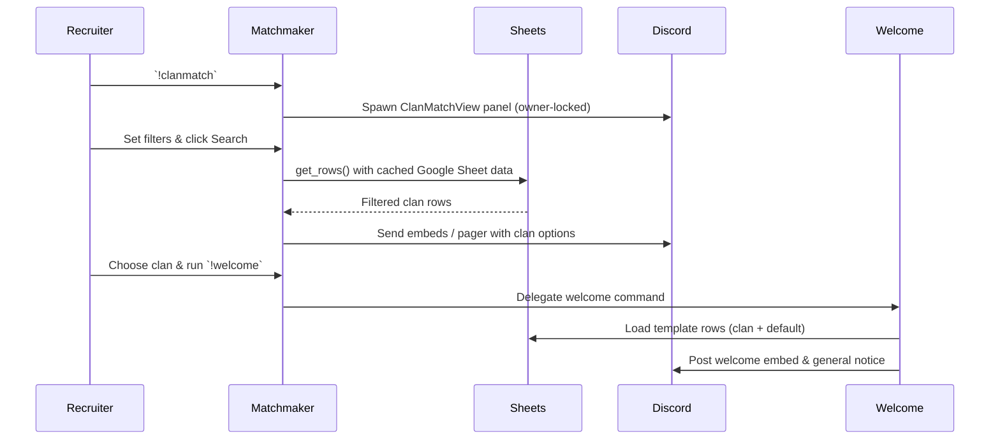

# C1C Matchmaker Functionality — 2025-10-14

## Overview
C1C Matchmaker is a Discord prefix-command bot that helps recruiters triage player applications, surface clan options, and publish welcome messaging while providing member-facing search panels and maintenance tooling.【F:AUDIT/legacy/clanmatch-welcomecrew/2025-10-10_code-export/MM/bot_clanmatch_prefix.py†L1629-L1657】【F:AUDIT/legacy/clanmatch-welcomecrew/2025-10-10_code-export/MM/welcome.py†L303-L405】Its scope covers recruiter-facing filtering, public search cards, clan profile lookups, and the templated welcome workflow; unrelated moderation or application intake occurs outside this codebase.

## Entry points, bot startup, and cog wiring
* `main()` boots both the Discord client and the auxiliary aiohttp web server after validating the `DISCORD_TOKEN`.【F:AUDIT/legacy/clanmatch-welcomecrew/2025-10-10_code-export/MM/bot_clanmatch_prefix.py†L2530-L2544】
* `start_webserver()` exposes readiness and health probes plus the emoji padding proxy used in embeds.【F:AUDIT/legacy/clanmatch-welcomecrew/2025-10-10_code-export/MM/bot_clanmatch_prefix.py†L2465-L2495】
* `on_ready()` seeds recurring tasks (`daily_recruiters_update`, `scheduled_cleanup`, `_watchdog`, and `sheets_refresh_scheduler`), syncs slash commands, and attaches the `Welcome` cog if it has not yet been added and primed.【F:AUDIT/legacy/clanmatch-welcomecrew/2025-10-10_code-export/MM/bot_clanmatch_prefix.py†L2197-L2236】
* The welcome cog is instantiated with sheet accessors, logging destinations, role gates, and default enablement derived from environment variables, then added asynchronously during the first `on_ready()` run.【F:AUDIT/legacy/clanmatch-welcomecrew/2025-10-10_code-export/MM/bot_clanmatch_prefix.py†L2497-L2527】【F:AUDIT/legacy/clanmatch-welcomecrew/2025-10-10_code-export/MM/bot_clanmatch_prefix.py†L2220-L2236】

## Function map
| File | Symbol | Responsibility |
| --- | --- | --- |
| `bot_clanmatch_prefix.py` | `get_ws`, `get_rows`, `clear_cache` | Lazy Google Sheets connection and caching of recruitment data.【F:AUDIT/legacy/clanmatch-welcomecrew/2025-10-10_code-export/MM/bot_clanmatch_prefix.py†L123-L149】 |
|  | `row_matches` et al. | Apply raid difficulty, CvC, Siege, playstyle, and roster filters to sheet rows.【F:AUDIT/legacy/clanmatch-welcomecrew/2025-10-10_code-export/MM/bot_clanmatch_prefix.py†L232-L315】 |
|  | `ClanMatchView` | Recruiter/member filter UI with select controls, roster toggles, pagination refresh, and search execution.【F:AUDIT/legacy/clanmatch-welcomecrew/2025-10-10_code-export/MM/bot_clanmatch_prefix.py†L1161-L1563】 |
|  | `PagedResultsView` / `MemberSearchPagedView` / `SearchResultFlipView` | Owner-locked Discord UI views that page result embeds or flip between profile/entry details.【F:AUDIT/legacy/clanmatch-welcomecrew/2025-10-10_code-export/MM/bot_clanmatch_prefix.py†L760-L1559】 |
|  | Prefix commands (`help`, `clanmatch`, `clansearch`, `clan`, `ping`, `health`, `reload`, etc.) | Recruiter/member/admin command surface for panels, clan lookup, liveness, and cache management.【F:AUDIT/legacy/clanmatch-welcomecrew/2025-10-10_code-export/MM/bot_clanmatch_prefix.py†L1566-L2091】 |
|  | Event handlers (`on_raw_reaction_add`, `on_message_delete`, gateway/watchdog events) | Reaction-based embed flipping and lifecycle telemetry for restarts.【F:AUDIT/legacy/clanmatch-welcomecrew/2025-10-10_code-export/MM/bot_clanmatch_prefix.py†L1989-L2297】 |
|  | `daily_recruiters_update`, `scheduled_cleanup`, `_watchdog`, `sheets_refresh_scheduler` | Background jobs for daily recruiter summaries, channel hygiene, zombie detection, and sheet cache refreshes.【F:AUDIT/legacy/clanmatch-welcomecrew/2025-10-10_code-export/MM/bot_clanmatch_prefix.py†L620-L722】【F:AUDIT/legacy/clanmatch-welcomecrew/2025-10-10_code-export/MM/bot_clanmatch_prefix.py†L2093-L2297】 |
| `welcome.py` | `Welcome` cog | Template caching, per-tag welcome embed assembly, permission checks, general notice posting, and runtime toggles.【F:AUDIT/legacy/clanmatch-welcomecrew/2025-10-10_code-export/MM/welcome.py†L17-L405】 |

## Event handlers
* `on_raw_reaction_add` swaps between clan profile and entry criteria embeds when users react with 💡, maintaining a flip registry and re-arming the reaction for reuse.【F:AUDIT/legacy/clanmatch-welcomecrew/2025-10-10_code-export/MM/bot_clanmatch_prefix.py†L1989-L2034】
* `on_message_delete` removes stale reaction flip registrations when messages disappear.【F:AUDIT/legacy/clanmatch-welcomecrew/2025-10-10_code-export/MM/bot_clanmatch_prefix.py†L2039-L2041】
* Gateway telemetry (`on_socket_response`, `on_connect`, `on_resumed`, `on_ready`, `on_disconnect`) updates connection timestamps used by the watchdog restart logic.【F:AUDIT/legacy/clanmatch-welcomecrew/2025-10-10_code-export/MM/bot_clanmatch_prefix.py†L2162-L2254】

## Commands and permissions
* Recruiter tools:
  * `!clanmatch` (cooldown 2s) opens or refreshes the recruiter panel in a configured thread and rejects callers lacking recruiter/admin roles.【F:AUDIT/legacy/clanmatch-welcomecrew/2025-10-10_code-export/MM/bot_clanmatch_prefix.py†L1678-L1797】【F:AUDIT/legacy/clanmatch-welcomecrew/2025-10-10_code-export/MM/bot_clanmatch_prefix.py†L1122-L1175】
  * `!clansearch` (cooldown 2s) launches a member-facing panel in-channel with the same filter set, tracked per user.【F:AUDIT/legacy/clanmatch-welcomecrew/2025-10-10_code-export/MM/bot_clanmatch_prefix.py†L1806-L1847】
  * `!clan <tag|name>` fetches sheet data, builds a profile embed (with padded emoji thumbnail), and registers the reaction flip state.【F:AUDIT/legacy/clanmatch-welcomecrew/2025-10-10_code-export/MM/bot_clanmatch_prefix.py†L1850-L1972】
* Welcome administration:
  * `!welcome` (cooldown 10s) validates template state, renders embeds, pings the recruit if configured, posts to the clan channel, and optionally announces in general chat.【F:AUDIT/legacy/clanmatch-welcomecrew/2025-10-10_code-export/MM/welcome.py†L303-L405】
  * `!welcome-refresh`, `!welcome-on`, `!welcome-off`, `!welcome-status` mutate the welcome cog cache/enable flags and all require the configured role set.【F:AUDIT/legacy/clanmatch-welcomecrew/2025-10-10_code-export/MM/welcome.py†L407-L443】
* Maintenance/admin:
  * `!help [topic]` provides command descriptions grouped by audience.【F:AUDIT/legacy/clanmatch-welcomecrew/2025-10-10_code-export/MM/bot_clanmatch_prefix.py†L1566-L1669】
  * `!ping`, `!health`, and `!reload` require admin/lead roles and surface liveness, connection latency, sheet status, and clear cached rows.【F:AUDIT/legacy/clanmatch-welcomecrew/2025-10-10_code-export/MM/bot_clanmatch_prefix.py†L2045-L2091】【F:AUDIT/legacy/clanmatch-welcomecrew/2025-10-10_code-export/MM/bot_clanmatch_prefix.py†L1122-L1148】
  * `!mmhealth` echoes environment metadata for platform probes.【F:AUDIT/legacy/clanmatch-welcomecrew/2025-10-10_code-export/MM/bot_clanmatch_prefix.py†L1799-L1803】

## Workflow — intake → screening → queueing → placement → escalation
1. **Intake**: Recruiters summon a private panel with `!clanmatch`, which records the panel per user and resolves the delivery channel based on fixed-thread configuration; unauthorized users are denied upfront.【F:AUDIT/legacy/clanmatch-welcomecrew/2025-10-10_code-export/MM/bot_clanmatch_prefix.py†L1678-L1797】
2. **Screening**: Within `ClanMatchView`, recruiters choose raid difficulties, playstyle, CvC/Siege toggles, and roster filters; changes update UI state and can auto-refresh existing result embeds.【F:AUDIT/legacy/clanmatch-welcomecrew/2025-10-10_code-export/MM/bot_clanmatch_prefix.py†L1161-L1364】
3. **Queueing**: Search execution pulls cached sheet rows, applies `row_matches`, enforces roster criteria, caps results, and stores the results message/view so subsequent tweaks update the same panel.【F:AUDIT/legacy/clanmatch-welcomecrew/2025-10-10_code-export/MM/bot_clanmatch_prefix.py†L232-L315】【F:AUDIT/legacy/clanmatch-welcomecrew/2025-10-10_code-export/MM/bot_clanmatch_prefix.py†L1365-L1559】
4. **Placement**: Recruiters review embeds (with pagination where necessary), drill into profiles or entry criteria via reaction flips, and can trigger the welcome cog to publish onboarding messages once a clan decision is made.【F:AUDIT/legacy/clanmatch-welcomecrew/2025-10-10_code-export/MM/bot_clanmatch_prefix.py†L760-L1559】【F:AUDIT/legacy/clanmatch-welcomecrew/2025-10-10_code-export/MM/welcome.py†L303-L405】
5. **Escalation**: Failures log to a central channel via `log_to_channel`, admin commands provide runtime status, and the watchdog restarts the bot if gateway activity stalls; daily summaries broadcast open-slot counts to recruiter threads.【F:AUDIT/legacy/clanmatch-welcomecrew/2025-10-10_code-export/MM/welcome.py†L17-L33】【F:AUDIT/legacy/clanmatch-welcomecrew/2025-10-10_code-export/MM/bot_clanmatch_prefix.py†L699-L2297】

## Data flows and persistence
* Recruitment data is read from a Google Sheet identified by `GOOGLE_SHEET_ID` and `WORKSHEET_NAME`, using cached `get_rows()` values with configurable TTL and service-account credentials from `GSPREAD_CREDENTIALS`.【F:AUDIT/legacy/clanmatch-welcomecrew/2025-10-10_code-export/MM/bot_clanmatch_prefix.py†L64-L149】
* Welcome templates load from a dedicated worksheet (default `WelcomeTemplates`) via `get_welcome_rows()`, caching per-clan rows and a C1C default fallback merged by `_merge_text_fields`.【F:AUDIT/legacy/clanmatch-welcomecrew/2025-10-10_code-export/MM/bot_clanmatch_prefix.py†L2506-L2513】【F:AUDIT/legacy/clanmatch-welcomecrew/2025-10-10_code-export/MM/welcome.py†L160-L247】
* Reaction flips maintain in-memory `REACT_INDEX` keyed by message ID, cleared when messages delete.【F:AUDIT/legacy/clanmatch-welcomecrew/2025-10-10_code-export/MM/bot_clanmatch_prefix.py†L1086-L1092】【F:AUDIT/legacy/clanmatch-welcomecrew/2025-10-10_code-export/MM/bot_clanmatch_prefix.py†L2039-L2041】
* Web health endpoints expose live status derived from connection timestamps, supporting platform probes without external storage.【F:AUDIT/legacy/clanmatch-welcomecrew/2025-10-10_code-export/MM/bot_clanmatch_prefix.py†L2303-L2350】

## Channels and roles touched
* Recruiter summaries post into `RECRUITERS_THREAD_ID`, tagging coordinator and scout role IDs pulled from the environment.【F:AUDIT/legacy/clanmatch-welcomecrew/2025-10-10_code-export/MM/bot_clanmatch_prefix.py†L98-L121】【F:AUDIT/legacy/clanmatch-welcomecrew/2025-10-10_code-export/MM/bot_clanmatch_prefix.py†L699-L721】
* Panels optionally relocate into a fixed recruiter thread (`PANEL_THREAD_MODE`/`PANEL_FIXED_THREAD_ID`) instead of the invoking channel.【F:AUDIT/legacy/clanmatch-welcomecrew/2025-10-10_code-export/MM/bot_clanmatch_prefix.py†L103-L1795】
* The welcome cog routes messages to per-clan `TARGET_CHANNEL_ID` values from the sheet, optionally pinging recruits and posting general notices into `WELCOME_GENERAL_CHANNEL_ID`.【F:AUDIT/legacy/clanmatch-welcomecrew/2025-10-10_code-export/MM/welcome.py†L212-L405】
* Role gates for recruiters, leads, and admins are configured via `RECRUITER_ROLE_IDS`, `LEAD_ROLE_IDS`, and `ADMIN_ROLE_IDS`, intersecting against member roles and admin permissions.【F:AUDIT/legacy/clanmatch-welcomecrew/2025-10-10_code-export/MM/bot_clanmatch_prefix.py†L1122-L1148】

## Scheduling and background jobs
* `sheets_refresh_scheduler()` clears and warms the sheet cache at configurable times-of-day using the optional log channel for refresh announcements.【F:AUDIT/legacy/clanmatch-welcomecrew/2025-10-10_code-export/MM/bot_clanmatch_prefix.py†L620-L657】
* `daily_recruiters_update()` posts the recruiter thread summary at 17:30 UTC each day, including optional role mentions.【F:AUDIT/legacy/clanmatch-welcomecrew/2025-10-10_code-export/MM/bot_clanmatch_prefix.py†L660-L721】
* `scheduled_cleanup()` periodically purges the bot’s own messages older than `CLEANUP_AGE_HOURS` from configured channels or threads.【F:AUDIT/legacy/clanmatch-welcomecrew/2025-10-10_code-export/MM/bot_clanmatch_prefix.py†L2093-L2170】
* `_watchdog` runs every `WATCHDOG_CHECK_SEC`, restarting the process if gateway events cease or disconnects exceed `WATCHDOG_MAX_DISCONNECT_SEC`.【F:AUDIT/legacy/clanmatch-welcomecrew/2025-10-10_code-export/MM/bot_clanmatch_prefix.py†L2258-L2297】

## External integrations
* Google Sheets provides recruitment data and welcome templates via `gspread` authenticated with a service-account JSON blob supplied in `GSPREAD_CREDENTIALS`.【F:AUDIT/legacy/clanmatch-welcomecrew/2025-10-10_code-export/MM/bot_clanmatch_prefix.py†L64-L149】
* The aiohttp server exposes `/health`, `/healthz`, and `/emoji-pad` endpoints; the latter fetches Discord emoji assets, enforces host allowlists, trims, pads, and serves PNGs to stabilize embed thumbnails.【F:AUDIT/legacy/clanmatch-welcomecrew/2025-10-10_code-export/MM/bot_clanmatch_prefix.py†L2303-L2457】

## Error handling, retries, and health hooks
* Command handlers and sheet loaders wrap operations in `try/except`, logging structured errors to the configured log channel and returning user-facing explanations; missing clan rows or channels short-circuit welcome posting with explicit replies.【F:AUDIT/legacy/clanmatch-welcomecrew/2025-10-10_code-export/MM/welcome.py†L212-L405】
* `row_matches` filtering and panel refresh logic guard against malformed sheet rows, ignoring headers and continuing on evaluation errors.【F:AUDIT/legacy/clanmatch-welcomecrew/2025-10-10_code-export/MM/bot_clanmatch_prefix.py†L232-L315】【F:AUDIT/legacy/clanmatch-welcomecrew/2025-10-10_code-export/MM/bot_clanmatch_prefix.py†L1257-L1364】
* Watchdog telemetry and health commands surface connectivity, latency, uptime, and last-event age, ensuring operators can detect zombie states before forced restarts.【F:AUDIT/legacy/clanmatch-welcomecrew/2025-10-10_code-export/MM/bot_clanmatch_prefix.py†L2054-L2297】

## Environment separation
Configuration relies exclusively on environment variables for tokens, sheet IDs, channel/role IDs, scheduling knobs, and feature flags, allowing distinct dev/test/prod deployments by swapping env values without code changes.【F:AUDIT/legacy/clanmatch-welcomecrew/2025-10-10_code-export/MM/bot_clanmatch_prefix.py†L64-L121】【F:AUDIT/legacy/clanmatch-welcomecrew/2025-10-10_code-export/MM/bot_clanmatch_prefix.py†L2258-L2297】

## Feature toggles and operational knobs
* `STRICT_PROBE`, `SHOW_TAG_IN_CLASSIC`, `SEARCH_RESULTS_SOFT_CAP`, and panel thread modes tune bot presentation and hosting behavior.【F:AUDIT/legacy/clanmatch-welcomecrew/2025-10-10_code-export/MM/bot_clanmatch_prefix.py†L44-L112】
* Welcome behavior toggles via `WELCOME_ENABLED`, `WELCOME_ALLOWED_ROLES`, `WELCOME_GENERAL_CHANNEL_ID`, and sheet tab overrides, plus runtime overrides through the welcome cog’s commands.【F:AUDIT/legacy/clanmatch-welcomecrew/2025-10-10_code-export/MM/bot_clanmatch_prefix.py†L2497-L2523】【F:AUDIT/legacy/clanmatch-welcomecrew/2025-10-10_code-export/MM/welcome.py†L303-L443】
* Cleanup cadence, roster filtering defaults, and emoji padding geometry are adjustable through dedicated env variables documented at the top of the module.【F:AUDIT/legacy/clanmatch-welcomecrew/2025-10-10_code-export/MM/bot_clanmatch_prefix.py†L80-L121】【F:AUDIT/legacy/clanmatch-welcomecrew/2025-10-10_code-export/MM/bot_clanmatch_prefix.py†L2093-L2170】

## Assumptions and invariants
* Discord tokens must be at least 50 characters and set via `DISCORD_TOKEN`, otherwise startup aborts.【F:AUDIT/legacy/clanmatch-welcomecrew/2025-10-10_code-export/MM/bot_clanmatch_prefix.py†L2530-L2538】
* Welcome templates require numeric `TARGET_CHANNEL_ID` entries per clan; missing or non-digit values block welcome posting.【F:AUDIT/legacy/clanmatch-welcomecrew/2025-10-10_code-export/MM/welcome.py†L326-L338】
* Reaction flips rely on message IDs staying stable; deletions clear state to avoid editing unrelated messages.【F:AUDIT/legacy/clanmatch-welcomecrew/2025-10-10_code-export/MM/bot_clanmatch_prefix.py†L1989-L2041】
* Recruiter panels remain owner-locked; interaction checks reject other users and instruct them to spawn their own panel.【F:AUDIT/legacy/clanmatch-welcomecrew/2025-10-10_code-export/MM/bot_clanmatch_prefix.py†L760-L1559】

## Mermaid sequence — Application submitted → placed

*Sequence references: panel creation, sheet access, and welcome publishing all stem from the cited command implementations.*【F:AUDIT/legacy/clanmatch-welcomecrew/2025-10-10_code-export/MM/bot_clanmatch_prefix.py†L1678-L1797】【F:AUDIT/legacy/clanmatch-welcomecrew/2025-10-10_code-export/MM/bot_clanmatch_prefix.py†L1365-L1559】【F:AUDIT/legacy/clanmatch-welcomecrew/2025-10-10_code-export/MM/welcome.py†L212-L405】

## Runtime prerequisites checklist
* Discord bot token in `DISCORD_TOKEN` (>=50 chars) and `intents.message_content` enabled.【F:AUDIT/legacy/clanmatch-welcomecrew/2025-10-10_code-export/MM/bot_clanmatch_prefix.py†L89-L95】【F:AUDIT/legacy/clanmatch-welcomecrew/2025-10-10_code-export/MM/bot_clanmatch_prefix.py†L1090-L1092】【F:AUDIT/legacy/clanmatch-welcomecrew/2025-10-10_code-export/MM/bot_clanmatch_prefix.py†L2530-L2538】
* Google service-account JSON (`GSPREAD_CREDENTIALS`) and sheet identifiers (`GOOGLE_SHEET_ID`, `WORKSHEET_NAME`, `WELCOME_SHEET_TAB`) accessible to the bot user.【F:AUDIT/legacy/clanmatch-welcomecrew/2025-10-10_code-export/MM/bot_clanmatch_prefix.py†L64-L149】【F:AUDIT/legacy/clanmatch-welcomecrew/2025-10-10_code-export/MM/bot_clanmatch_prefix.py†L2506-L2513】
* Discord role IDs for recruiters, leads, admins, and welcome command access configured in the environment, matching server roles.【F:AUDIT/legacy/clanmatch-welcomecrew/2025-10-10_code-export/MM/bot_clanmatch_prefix.py†L103-L121】【F:AUDIT/legacy/clanmatch-welcomecrew/2025-10-10_code-export/MM/bot_clanmatch_prefix.py†L1122-L1148】【F:AUDIT/legacy/clanmatch-welcomecrew/2025-10-10_code-export/MM/welcome.py†L197-L280】
* Channel/thread IDs for recruiter summaries, panel threads, and welcome/general destinations defined and the bot granted send/manage permissions in those locations.【F:AUDIT/legacy/clanmatch-welcomecrew/2025-10-10_code-export/MM/bot_clanmatch_prefix.py†L98-L121】【F:AUDIT/legacy/clanmatch-welcomecrew/2025-10-10_code-export/MM/welcome.py†L212-L405】
* Optional web server port (`PORT`) reachable for health probes if deploying with platform monitoring.【F:AUDIT/legacy/clanmatch-welcomecrew/2025-10-10_code-export/MM/bot_clanmatch_prefix.py†L2465-L2495】

Doc last updated: 2025-10-14 (v0.9.5)
