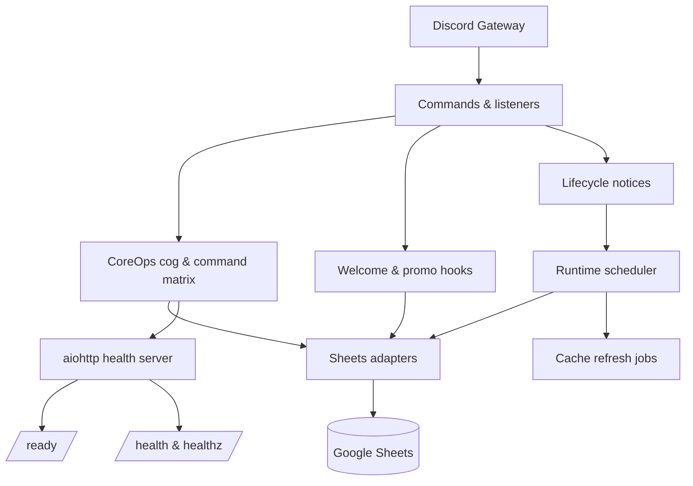

# Architecture Overview

## Runtime map

## Module map
- CoreOps extensions load directly from `c1c_coreops`.
- `packages/c1c-coreops/` — canonical home for the CoreOps cog, RBAC helpers, embed renderers, and prefix utilities.
- CoreOps helpers live exclusively under `c1c_coreops.*`.
- `shared.sheets.*` — Sheets adapters (recruitment, onboarding, cache core) with async
  facades for event-loop safety.

CoreOps code exists **only** in `packages/c1c-coreops`. The `audit-coreops` workflow
fails CI if any legacy imports, shims, or duplicate symbols live elsewhere.

## Configuration & Startup
Config validation is performed during bot startup (e.g., in `setup()`), not at package import, so libraries remain importable in build pipelines.

## Monorepo workspaces
- `shared/` — infrastructure plumbing that anchors this bot's runtime
  (Sheets adapters, cache, HTTP clients). Shared code here is tightly coupled to
  the recruitment runtime and should not embed feature logic.
- `modules/` — feature code scoped to this bot (commands, views, services) that
  can assume the recruitment runtime and environment.
- `packages/` — reusable feature libraries intended for multiple bots. Install
  locally with `pip install -e ./packages/<package>` during development. Packages
  should remain runtime-agnostic and avoid importing from `modules/`.

### CoreOps extraction plan
1. CoreOps utilities now live in `packages/c1c-coreops` and the bot imports them directly.
2. Flip imports in `modules/coreops` to consume the packaged helpers once the
   APIs stabilize.
3. Deprecate any remaining feature logic living in `shared/` so only
   infrastructure primitives remain.

_Recruitment Search path (Sheets → Matcher) is integrated backend-only and feature-flagged
off in production until the panels ship._

### Legend
- Solid nodes = active in production.
- Dashed nodes = integrated but disabled in production (feature-flagged).
- `[watcher]` marks event-driven listeners tied to Discord webhooks.
- `[lifecycle]` marks CoreOps lifecycle notices (startup, reload, manual refresh). For
  one release the bot emits `[watcher|lifecycle]` to avoid breaking filters.
- `[cron]` marks scheduled jobs emitted by the runtime scheduler.
- Grey callouts describe shared helpers used by multiple features.

## Wave 3 dependency highlights
- Boot order: config → runtime → shared Sheets core → recruitment/onboarding adapters →
  features → Discord extensions. Abort boot if config or sheets layers fail.
- Watchdog owns keepalive cadences, stall detection, reconnect timers, and feeds its
  metrics into the health server output.
- Runtime scheduler handles cache refreshes (`clans`, `templates`, `clan_tags`) and posts
  `[cache]` summaries to the ops channel.

## Data paths
- Reads: commands and watcher listeners use `shared.sheets.recruitment` /
  `shared.sheets.onboarding`, which delegate to `shared.sheets.core` before
  hitting Google Sheets caches.
- Writes: onboarding listeners call `shared.sheets.onboarding` helpers with bounded retries and
  per-tab cache invalidation.

## Recruitment visuals pipeline
- `modules.recruitment.cards` & `modules.recruitment.views` compose embeds for clan panels.
- `cogs.recruitment_recruiter.RecruiterPanelCog` registers `!clanmatch` and embeds the
  recruiter panel view while staying text-only (no `emoji_pipeline` dependency).
- `modules.recruitment.emoji_pipeline` resolves guild emoji, falls back when proxies are strict,
  and builds attachment thumbnails when needed.
- `/emoji-pad` (aiohttp) trims, pads, and caches PNG emoji when `PUBLIC_BASE_URL` or
  `RENDER_EXTERNAL_URL` is configured.
- Sheets cache paths remain unchanged; data still flows through `sheets.recruitment`.

### Command loading
- All commands register under modules in `cogs/*`. Feature modules supply views, embeds,
  and services without performing command registration on import.

## Feature toggles & gating
- `modules.common.feature_flags.is_enabled(<key>)` runs during module boot; missing worksheets,
  or values fail closed and keep the feature offline.
- Backbone services (cache, scheduler, health server, RBAC) never consult the toggle
  sheet and always load.
- Approved keys:
  - `member_panel` — member search panels.
  - `recruiter_panel` — recruiter dashboards and match tools.
  - `recruitment_welcome` — welcome command.
  - `welcome_enabled` — global enable for onboarding automation listeners.
  - `enable_welcome_hook` — enables the welcome thread watcher.
  - `enable_promo_watcher` — enables the promo thread watcher.
  - `recruitment_reports` — Daily Recruiter Update (UTC scheduler + `!report recruiters`).
  - `placement_target_select` — stub module for future placement picker.
  - `placement_reservations` — stub module for future reservation workflow.
- Toggles live in the recruitment Sheet `FeatureToggles` worksheet; `TRUE`/`true`/`1`
  enable a feature, `FALSE`/`false`/`0` disable it. Misconfigurations post a single admin-ping warning to the runtime log
  channel.
- Watcher registration is driven solely by FeatureToggles entries rather than environment keys.
- RBAC derives from `c1c_coreops.rbac`, mapping `ADMIN_ROLE_IDS`, `STAFF_ROLE_IDS`,
  `RECRUITER_ROLE_IDS`, and `LEAD_ROLE_IDS` from configuration.

## Health & observability
- `/healthz` aggregates watchdog state, last refresh timestamps, and cache health.
- Structured logs emit `[ops]`, `[cron]`, `[lifecycle]`, `[refresh]`, and `[command]` tags
  with context for quick filtering in Discord.
- Failures fall back to stale caches when safe and always raise a structured log to
  `LOG_CHANNEL_ID`.

Doc last updated: 2025-10-30 (v0.9.7)
