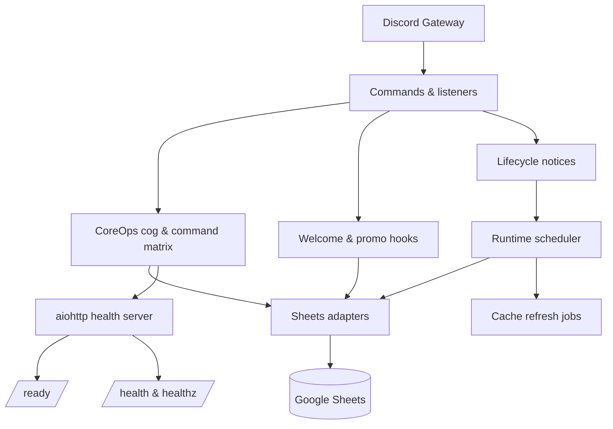

# Architecture Overview

## Runtime map

## Runtime surfaces
- **Discord gateway → CoreOps entrypoint.** Discord events and commands land in the
  c1c-coreops cog first. CoreOps performs RBAC checks, runs lifecycle hooks
  (`startup`, `reload`, `refresh`), and routes execution to the feature modules in
  `cogs/` and `modules/`.
- **Scheduler & watchdog.** `Runtime.scheduler` drives cache refresh jobs and
  timed digests, while the watchdog monitors gateway heartbeats using the
  `WATCHDOG_*` thresholds and exits the process when the Discord connection is
  stale. See [`docs/ops/Watchers.md`](ops/Watchers.md) for the watcher inventory,
  keepalive behaviour, and cadence details.
- **Sheets façade.** `shared.sheets.async_facade` wraps the synchronous Sheets
  adapters so cache misses and writes never block the event loop. CoreOps and the
  feature modules only call the async façade.
- **HTTP health server.** The aiohttp site exposes `/`, `/ready`, `/health`, and
  `/healthz`. Each request logs a structured JSON entry via
  `shared.logging.structured.JsonFormatter` and reuses the trace id echoed in the
  headers.

## External integrations
- **Discord.** Guild intents and permissions are configured in the Dev Portal.
  Admin bang aliases (`!reload`, `!refresh all`, `!perm`, etc.) remain restricted
  to the Admin role list defined in the config registry.
- **Google Sheets.** Recruitment, onboarding, reservations, milestones, and
  feature toggle tabs feed every module. Cache buckets (`clans`, `templates`,
  `clan_tags`, `welcome_templates`, etc.) wrap these tabs and are refreshed via
  the scheduler or `!ops refresh`.
- **Render.** Render manages container builds, environment separation, and health
  restarts. Production and test services both use the same runtime image; only
  `ENV_NAME`, credentials, and sheet IDs differ.

## Data flow highlights
1. **Onboarding + welcome.** A recruiter or watcher opens a welcome ticket,
   onboarding questions run inside the thread, and the resulting sheet row is
   reconciled via the onboarding adapter before a placement log posts to the ops
   channel.
2. **Recruitment panels.** `!clanmatch` and the recruiter panel commands read the
   recruitment caches, render embeds (including emoji pipeline fallbacks), and
   record telemetry for every refresh.
3. **Reservations and placement.** `!reserve` and the watcher-driven placement
   reconciliation share the reservations sheet adapter documented in
   [`docs/modules/Placement.md`](modules/Placement.md). Manual adjustments update the
   sheet, recompute availability columns (`AF/AH/AI`), post placement summaries,
   and feed the reminder/auto-release cron jobs that keep stale reservations from
   blocking capacity.
4. **Feature toggles.** Module boot calls
   `modules.common.feature_flags.is_enabled()` for each toggle. Missing tabs or
   unset keys fail closed so disabled modules never partially load.

## Environment separation
- **Test.** Uses isolated Discord guilds, sheet copies, and lower watchdog
  intervals (e.g., `WATCHDOG_CHECK_SEC=60`). Admins can run development toggles
  such as `SHOW_EMPTY_SECTIONS=1` without affecting production telemetry.
- **Production.** Mirrors the same modules but points to the live sheets and uses
  the longer watchdog thresholds (default 360 seconds). Render redeploys follow
  the GitHub Actions queue; only the latest commit for a branch executes.
- **Shared invariants.** Both environments require the same env keys listed in
  `docs/ops/Config.md`, the same CoreOps package, and the same health endpoints
  so CI and monitors stay consistent.

## Flow notes
- **CoreOps cog funnels every command.** RBAC checks run before cache calls, and shared helpers live exclusively inside the `c1c_coreops` package.
- **Cache access stays async-safe.** Command handlers import `shared.sheets.async_facade`, which routes any synchronous helper through `asyncio.to_thread` so cache misses do not block the event loop.
- **Preloader and scheduler coordinate cache health.** Startup warmers emit `[refresh] startup` logs for every bucket, while the scheduler handles recurring refreshes (`clans`, `templates`, `clan_tags`) and posts summaries to the ops channel.
- **Telemetry powers embed rendering.** Command responses lean on structured telemetry before handing the payload to the embed renderer; version metadata is anchored in the footer (`Bot v… · CoreOps v…`).
- **HTTP surface mirrors Discord health.** `/` returns a status payload with trace id, `/ready` exposes readiness details, `/health` merges watchdog metrics with component status, and `/healthz` remains the bare liveness probe. Each request carries a UUID trace id echoed in the response headers and structured logs.
- **Logging stays structured.** Runtime logs emit JSON via `shared.logging.structured.JsonFormatter` with standard keys (`ts`, `level`, `logger`, `msg`, `trace`, `env`, `bot`) plus contextual extras. HTTP access logs land under `aiohttp.access` with `path`, `method`, `status`, and latency in milliseconds.

## Module map
- CoreOps extensions load directly from `c1c_coreops`.
- `packages/c1c-coreops/` — canonical home for the CoreOps cog, RBAC helpers, embed renderers, and prefix utilities.
- CoreOps helpers live exclusively under `c1c_coreops.*`.
- `shared.sheets.*` — Sheets adapters (recruitment, onboarding, cache core) with async
  facades for event-loop safety.

CoreOps code exists **only** in `packages/c1c-coreops`. The `audit-coreops` workflow
fails CI if any legacy imports, shims, or duplicate symbols live elsewhere.

## Configuration & Startup
Config validation is performed during bot startup (e.g., in `setup()`), not at package import, so libraries remain importable in build pipelines.

## Monorepo workspaces
- `shared/` — infrastructure plumbing that anchors this bot's runtime
  (Sheets adapters, cache, HTTP clients). Shared code here is tightly coupled to
  the recruitment runtime and should not embed feature logic.
- `modules/` — feature code scoped to this bot (commands, views, services) that
  can assume the recruitment runtime and environment.
- `packages/` — reusable feature libraries intended for multiple bots. Install
  locally with `pip install -e ./packages/<package>` during development. Packages
  should remain runtime-agnostic and avoid importing from `modules/`.

### CoreOps extraction plan
1. CoreOps utilities now live in `packages/c1c-coreops` and the bot imports them directly.
2. Flip imports in `modules/coreops` to consume the packaged helpers once the APIs stabilize.
3. Deprecate any remaining feature logic living in `shared/` so only infrastructure primitives remain.

_Recruitment Search path (Sheets → Matcher) is integrated backend-only and feature-flagged
off in production until the panels ship._

### Legend
- Solid nodes = active in production.
- Dashed nodes = integrated but disabled in production (feature-flagged).
- `[watcher]` marks event-driven listeners tied to Discord webhooks.
- `[lifecycle]` marks CoreOps lifecycle notices (startup, reload, manual refresh). For
  one release the bot emits `[watcher|lifecycle]` to avoid breaking filters.
- `[cron]` marks scheduled jobs emitted by the runtime scheduler.
- Grey callouts describe shared helpers used by multiple features.

## Wave 3 dependency highlights
- Boot order: config → runtime → shared Sheets core → recruitment/onboarding adapters →
  features → Discord extensions. Abort boot if config or sheets layers fail.
- Watchdog owns keepalive cadences, stall detection, reconnect timers, and feeds its
  metrics into the health server output.
- Runtime scheduler handles cache refreshes (`clans`, `templates`, `clan_tags`) and posts
  `[cache]` summaries to the ops channel.

## Data paths
- Reads: commands and watcher listeners use `shared.sheets.recruitment` /
  `shared.sheets.onboarding`, which delegate to `shared.sheets.core` before
  hitting Google Sheets caches.
- Writes: onboarding listeners call `shared.sheets.onboarding` helpers with bounded retries and
  per-tab cache invalidation.

## Recruitment visuals pipeline
- `modules.recruitment.cards` & `modules.recruitment.views` compose embeds for clan panels.
- `cogs.recruitment_recruiter.RecruiterPanelCog` registers `!clanmatch` and embeds the
  recruiter panel view while staying text-only (no `emoji_pipeline` dependency).
- `modules.recruitment.emoji_pipeline` resolves guild emoji, falls back when proxies are strict,
  and builds attachment thumbnails when needed.
- `/emoji-pad` (aiohttp) trims, pads, and caches PNG emoji when `PUBLIC_BASE_URL` or
  `RENDER_EXTERNAL_URL` is configured.
- Sheets cache paths remain unchanged; data still flows through `sheets.recruitment`.

### Command loading
- All commands register under modules in `cogs/*`. Feature modules supply views, embeds,
  and services without performing command registration on import.

## Help metadata
- Commands opt into the multi-embed help surface via the `help_metadata` decorator.
- `@Bot help` dynamically discovers commands from the live registry with `bot.walk_commands()` and filters each candidate with `command.can_run(ctx)` so RBAC decorators remain authoritative.
- Every reply includes Overview + Admin / Operational + Staff + User embeds; sections without runnable commands collapse unless `SHOW_EMPTY_SECTIONS=true` swaps in a “Coming soon” placeholder.
- Valid `function_group` values: `operational`, `recruitment`, `milestones`, `reminder`, `general`.
- Bare admin aliases follow `COREOPS_ADMIN_BANG_ALLOWLIST`. Admins see `!command` when the allowlist authorizes a bare alias and a runnable bare command exists; otherwise they see `!ops command`. Staff always see `!ops …`, and members only see user-tier commands plus the mention routes.

## Feature toggles & gating
- `modules.common.feature_flags.is_enabled(<key>)` runs during module boot; missing worksheets,
  or values fail closed and keep the feature offline.
- Backbone services (cache, scheduler, health server, RBAC) never consult the toggle
  sheet and always load.
- Approved keys:
  - `clan_profile` — public `!clan` command with crest and 💡 reaction toggle.
  - `member_panel` — member search panels.
  - `recruiter_panel` — recruiter dashboards and match tools.
  - `recruitment_welcome` — welcome command.
  - `welcome_enabled` — global enable for onboarding automation listeners.
  - `enable_welcome_hook` — enables the welcome thread watcher.
  - `enable_promo_watcher` — enables the promo thread watcher.
  - `recruitment_reports` — Daily Recruiter Update (UTC scheduler + `!report recruiters`).
  - `placement_target_select` — stub module for future placement picker.
  - `placement_reservations` — stub module for future reservation workflow.
- Toggles live in the recruitment Sheet `FeatureToggles` worksheet; `TRUE`/`true`/`1`
  enable a feature, `FALSE`/`false`/`0` disable it. Misconfigurations post a single admin-ping warning to the runtime log
  channel.
- Watcher registration is driven solely by FeatureToggles entries rather than environment keys.
- RBAC derives from `c1c_coreops.rbac`, mapping `ADMIN_ROLE_IDS`, `STAFF_ROLE_IDS`,
  `RECRUITER_ROLE_IDS`, and `LEAD_ROLE_IDS` from configuration.

## Health & observability
- `/healthz` aggregates watchdog state, last refresh timestamps, and cache health.
- Structured logs emit `[ops]`, `[cron]`, `[lifecycle]`, `[refresh]`, and `[command]` tags with context for quick filtering in Discord (transitioning from `[watcher|lifecycle]` to `[lifecycle]` during the dual-tag release).
- Failures fall back to stale caches when safe and always raise a structured log to `LOG_CHANNEL_ID`.

Doc last updated: 2025-11-17 (v0.9.7)
