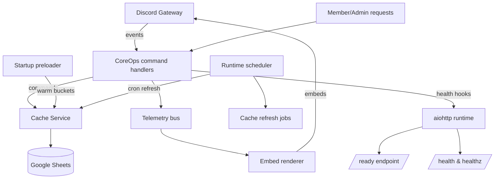

# CoreOps Architecture

### Flow notes
- **Diagram legend:** CoreOps command handlers (purple) orchestrate Shared services (blue),
  which expose async facades to feature modules (green).
- **Discord Cog → CoreOps:** All commands funnel through the shared CoreOps cog. RBAC
  decisions happen before touching cache APIs.
- **Cache service:** Every cache interaction uses the public API (`get_snapshot`,
  `refresh_now`). Private module attributes remain internal to the service.
- **Google Sheets:** Recruitment and onboarding tabs are accessed asynchronously via the
  cached adapters. Preloader warms their handles and key buckets on startup.
- **Sheets access:** Async command handlers import `shared.sheets.async_facade`, which
  routes synchronous helpers through `asyncio.to_thread` so the event loop stays
  unblocked even on cache misses.
- **Health system:** `shared.health` tracks component readiness; the runtime flips
  statuses for `/ready` and `/health` whenever Discord or the HTTP server changes state.
- **Preloader:** Runs automatically during boot, logging `[refresh] startup` entries for
  each bucket.
- **Scheduler:** Handles cron work for cache refreshes (`clans`, `templates`,
  `clan_tags`) and posts results to the ops channel.
- **Telemetry → Embed renderer:** Command responses pull structured telemetry and render
  embeds without timestamps; version metadata lives solely in the footer.
- **Runtime HTTP interface:** `/` returns the status payload and echoes the request
  trace id, `/ready` exposes the readiness gate with component details, `/health`
  combines the watchdog metrics with the component map, and `/healthz` remains the
  bare liveness probe.
- **Logging & observability:** All runtime logs emit JSON via
  `shared.logging.structured.JsonFormatter` with
  `ts`,`level`,`logger`,`msg`,`trace`,`env`,`bot` plus contextual extras. HTTP
  access logs are emitted under the canonical `aiohttp.access` logger with
  `path`,`method`,`status`, and latency (`ms`).
- **Request tracing:** Every web request receives a UUIDv4 trace id that flows
  through the log context, `/` response payload, and the `X-Trace-Id` response
  header for quick correlation.

### Module topology
- CoreOps now lives in `packages/c1c-coreops/src/c1c_coreops/`.
- CoreOps helpers ship only in the `c1c_coreops` package; no shared shims remain.

### Help metadata
- Commands opt-in to the multi-embed help surface via the `help_metadata` decorator.
- Each command carries `access_tier` (admin/staff/user), a `function_group`, and a
  `help_section` hint so `@Bot help` can assemble the Overview + Admin/Staff/User embeds.
- Empty sections collapse automatically; set `SHOW_EMPTY_SECTIONS=true` to render a
  “Coming soon” placeholder. The footer always reads `Bot v… · CoreOps v… • For details: @Bot help`.

### Feature gating at load
- **Module wiring:** Feature modules call `modules.common.feature_flags.is_enabled(<key>)` during boot.
  Disabled toggles block command registration and watcher wiring; the bot logs the skip
  and continues.
- **Backbone always-on:** Scheduler, cache service, health probes, RBAC helpers, and the
  watchdog never consult feature toggles. They remain active even when every feature key
  fails.
- **Fail-closed behavior:** Missing worksheet, headers, or row values evaluate to
  `False`. The runtime emits a single admin-ping warning per issue in the log channel and
  leaves the module offline until the Sheet is fixed and refreshed.
- **Feature map:**
  - `member_panel` — member view of recruitment roster/search panels.
  - `recruiter_panel` — recruiter dashboard, match queue, and escalations.
  - `recruitment_welcome` — welcome command (welcome/promo listeners remain env-gated).
  - `recruitment_reports` — Daily Recruiter Update (UTC scheduler + `!report recruiters`).
  - `placement_target_select` — stub module (no runtime surface yet).
  - `placement_reservations` — stub module (no runtime surface yet).

Doc last updated: 2025-10-26 (v0.9.6)
